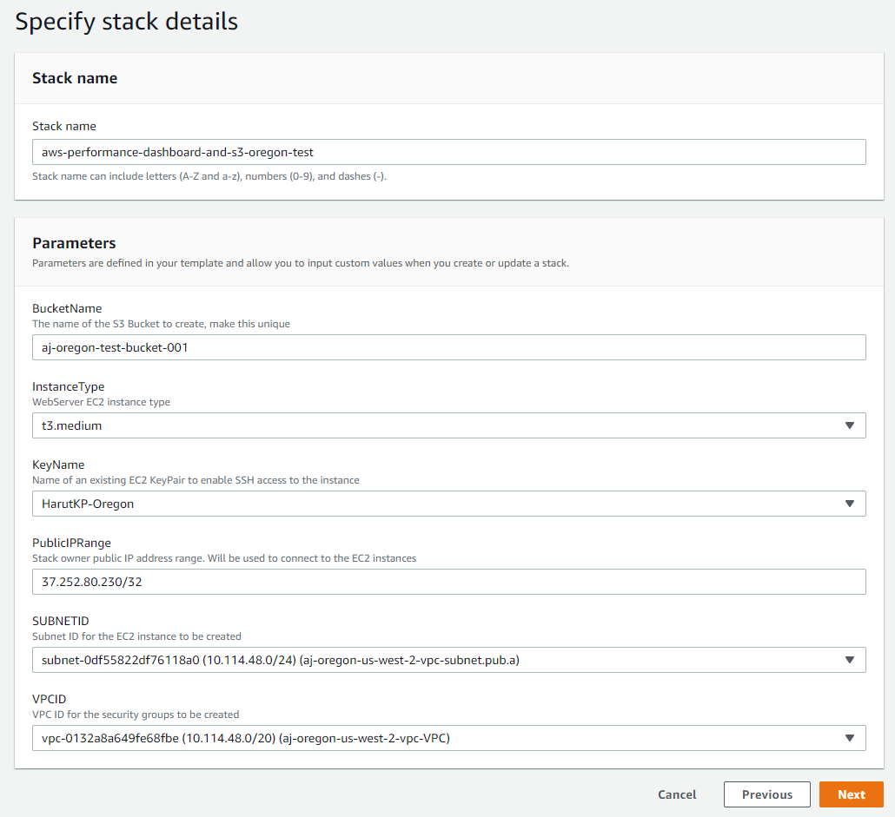
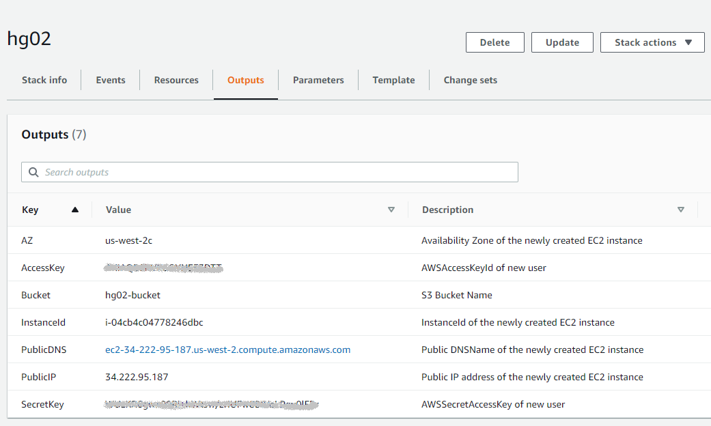

## Introduction
The AWS Performance Test Execution Framework is a custom built auto scalable solution that uses generated EC2 instances with a JMeter test module to simulate user traffic to the ICAP server.

Overall, logical structure looks like this:


There are 2 ways to trigger load: via UI interface or via command line python script.

In nutshell, user triggers load via UI or command line python script to indicate what kind of traffic needs to be generated, then automation will take care of creating necessary EC2 instances that will trigger load and also it will create performance analytics dashboard automatically.

There are 2 AWS community images created in AWS Ireland, North Virginia, Oregon and North California regions in order to make use of this performance test framework more easier:

 - ICAPServer Performance Test and Analytics Ubuntu - this image is used to create Performance Dashboard automatically and also has UI interface to trigger load
 - ICAPServer-Performance-Load-Generator - this image is used during Load Generation triggering in EC2 Auto Scale Cloudformation script.

This document will show simple way to get started utilizing this framework step by step.

**Before starting**
- Make sure to clone https://github.com/k8-proxy/aws-jmeter-test-engine.git this repo    to your local machine
- Ensure that you have write access to VPC, Subnets, EC2, Security Group, S3, IAM Role,  CloudFormation and Secrets Manager services in AWS.
- Install AWS CLI in your local machine: https://docs.aws.amazon.com/cli/latest/userguide/install-cliv2.html
- Ensure that there is one AWS KeyPair available so that it can be attached to EC2 instances being created. It can be created in AWS console->EC2->Key Pairs->Create Key pair.
- Ensure that all resources are created (using instructions below) in a single AWS       supported region, not in multi-regions. Mixing them between different regions might    break the automation or also slow it down due to network latency.


## How to get started?

# Step 1. VPC, Subnets & Security Groups creation


**Create VPC and Subnets if non existent**

If there are no existing VPC and Subnets available then there are separate Cloudformation scripts are available to create VPC & Subnets for each of supported regions mentioned above. 
Scripts are located in jmeter-icap/cloudformation/ source folder 

Ensure that correct region VPC & Subnets cloudformation is used during the stack creation.

The VPC & Subnets cloudformation stack can be created using 2 ways:
- Using AWS Console -> Goto Services -> CloudFormation->Create Stack (new resources) and follow steps there

| Region           | Stack                                                                                                                                                                                                                                                                                                                                      |
|------------------|--------------------------------------------------------------------------------------------------------------------------------------------------------------------------------------------------------------------------------------------------------------------------------------------------------------------------------------------|
| Ireland          | [](https://console.aws.amazon.com/cloudformation/home?region=eu-west-1#/stacks/new?stackName=VPCSubnetsStack&templateURL=https://aws-icap-test-engine-cf-templates.s3-eu-west-1.amazonaws.com/AWS-CloudFormation-VPC-6-Subnets-eu-west-1.json) |
| North Virginia   | [](https://console.aws.amazon.com/cloudformation/home?region=us-east-1#/stacks/new?stackName=VPCSubnetsStack&templateURL=https://aws-icap-test-engine-cf-templates.s3-eu-west-1.amazonaws.com/AWS-CloudFormation-VPC-6-Subnets-us-east-1.json) |
| Oregon           | [](https://console.aws.amazon.com/cloudformation/home?region=us-west-2#/stacks/new?stackName=VPCSubnetsStack&templateURL=https://aws-icap-test-engine-cf-templates.s3-eu-west-1.amazonaws.com/AWS-CloudFormation-VPC-6-Subnets-us-west-2.json) |
| North California | [](https://console.aws.amazon.com/cloudformation/home?region=us-west-1#/stacks/new?stackName=VPCSubnetsStack&templateURL=https://aws-icap-test-engine-cf-templates.s3-eu-west-1.amazonaws.com/AWS-CloudFormation-VPC-6-Subnets-us-west-1.json) |


- Using AWS CLI command (this is template command, repo path and CF name needs to be changed)
```bash
aws cloudformation create-stack --stack-name myteststack --template-body file:///pathtorepo/jmeter-icap/cloudformation/AWS-CloudFormation-VPC-6-Subnets-change-region.json

```

# Step 2. Create AWS IAM Role with Access to AWS Secret Manager and to S3 bucket

LoadGenerator instances will need to access S3 to fetch data and also access Secrets Manager to get AWS & grafana keys. 

In order to have that access we need to create an IAM role for the LoadGenerator Instances.

There is cloudformation in place to automatically create the IAM role.
The cloudformation script is located in your local clone of git repo under jmeter-icap/cloudformation/aws-secret-manager-with_iam_role.json or direct url from the repo is: https://github.com/k8-proxy/aws-jmeter-test-engine/blob/master/jmeter-icap/cloudformation/aws-secret-manager_with_-iam-role.json Cloudformation script.

There are 2 ways to run CloudFormation script in aws:

1. Using Console
   - Find CloudFormation Service in AWS console from Services -> Search for CloudFormation
   - Click on Create Stack
   - Select Upload Template
   - Click Next
   - Give stack name
   - Click next until it says create and then click create. (Tick confirm box whenever it asks for confirmation)

| Region           | Stack                                                                                                                                                                                                                                                                                                                                      |
|------------------|--------------------------------------------------------------------------------------------------------------------------------------------------------------------------------------------------------------------------------------------------------------------------------------------------------------------------------------------|
| Ireland          | [](https://console.aws.amazon.com/cloudformation/home?region=eu-west-1#/stacks/new?stackName=AWS-Test-Engine-IAM-Role&templateURL=https://aws-icap-test-engine-cf-templates.s3-eu-west-1.amazonaws.com/aws-secret-manager_with_-iam-role.json) |
| North Virginia   | [](https://console.aws.amazon.com/cloudformation/home?region=us-east-1#/stacks/new?stackName=AWS-Test-Engine-IAM-Role&templateURL=https://aws-icap-test-engine-cf-templates.s3-eu-west-1.amazonaws.com/aws-secret-manager_with_-iam-role.json) |
| Oregon           | [](https://console.aws.amazon.com/cloudformation/home?region=us-west-2#/stacks/new?stackName=AWS-Test-Engine-IAM-Role&templateURL=https://aws-icap-test-engine-cf-templates.s3-eu-west-1.amazonaws.com/aws-secret-manager_with_-iam-role.json) |
| North California | [](https://console.aws.amazon.com/cloudformation/home?region=us-west-1#/stacks/new?stackName=AWS-Test-Engine-IAM-Role&templateURL=https://aws-icap-test-engine-cf-templates.s3-eu-west-1.amazonaws.com/aws-secret-manager_with_-iam-role.json) |

2. Using AWS CLI

```bash
aws cloudformation create-stack --stack-name myteststack --template-body file:///pathtorepo/jmeter-icap/cloudformation/aws-secret-manager_with_-iam-role.json --capabilities CAPABILITY_NAMED_IAM

```
After IAM role is created, goto AWS console -> IAM->Roles, select created IAM role and assign EC2 FullAccess and CloudFormationFull Access policies to the IAM role.

The newly created IAM role will be automatically attached the EC2 instances of the deployment

# Step 3. Setup Performance Dashboard system, create the S3 bucket, create a user with S3 bucket access

- From your local repo clone run the following cloud formation script: jmeter-icap/cloudformation/AWS-Performance-Dashboard-and-S3-Bucket.yaml using console
   - Find CloudFormation Service in AWS console from Services -> Search for CloudFormation
   - Click on Create Stack
   - Select Upload Template
   - Click Next
   - Give stack name
   - Enter the SSH key name (choose from the drop down box), public IP range, S3 bucket name to be created.

   - Click next until it says "Create Stack".
   - Confirm that the script can create IAM resources and click "Create Stack".

- After the script completes successfully open the OUTPUT tab and save the newly created Secret Key and Access Key in the Secret Manager. They will be needed in following step:



# Step 4. Create Secret Manager with your AWS Access and Secret Key

- Open AWS UI Console
- Goto Services
- Select Secrets Manager
- Click on Store New Secret
- Select Other types of secrets
- Enter following secret keys and values (best to copy names and remove " from key names)
    1. Secret Key Name = "AWS_Access_Key"
       Secret Value = Your access key here created just before
    2. Click Add row (keep that white space before closing quote ")
       Secret Key Name = "AWS_Secret_Key "
       Secret Value = Your AWS secret access key created just before
- Click next and give Name
- Click next and select disable automatic rotation
- Click next and click Store
- Select secrets name created and save Secret ARN.

**Verify you can access the Performance Dashboard system**

- Open Browser and enter http://[instance public ip]:3000
- Grafana ui opens and login with username/password: admin/glasswall
- Verify that Load Generator UI is also visible: http://[instance public ip]

# Step 5. Prepare the Load Generator script

**Checking & replacing values in the GenerateLoadGenerators.json script**

Next step is to ssh to this EC2 instance (username: ubuntu) and :
```bash
sudo nano /opt/git/aws-jmeter-test-engine/jmeter-icap/cloudformation/GenerateLoadGenerators.json
```

**Replace & save the following parameters with your own value**:

- VpcId - vpc id created above

- SubnetIds - public subnets ids list created above

- KeyPairName - your key pair name used to access AWS EC2 instances. If you do not have one, it can be created from AWS console.

- AmiImage - this is id (ami-0338f171cb4aa527c) from ICAPServer-Performance-Load-Generator AWS community image. Note: this id from Ireland AWS Region. If you are on different region, please, check AMI id in that region AWS Community.

- InstanceSecurityGroup - ICAP-Performance-LG-SG (created above with cloud formation) security group id

All these data can be found under EC2 Service > Instances > Click on Your Instance ID.
- VPC and Subnets can be found on the top of this page.
- AMI and Key Pair Name can be found under the Details tab.
- Security Group can be found under Security tab.


Note: If you would like to use command line options to trigger load from your local machine then above modifications needs to be done in your local copy of GenerateLoadGenerators.json file. 

# Step 6. UI Setup, Copy Test Data to S3 & Generate load

**UI Setup**

- Open browser and go to http://[instance public ip]
- Click on Setup link. System loads default configurations.
- Make necessary changes and also tick "Upload Test Data to S3 Test Data Bucket" option


- Modify other paramaters also accordingly
- Click Submit configurations.

**How to generate load?**

The framework provides 2 options to trigger load:

Option 1: UI interface. 
- Please, follow the following instructions to start the load via UI:
    - https://github.com/k8-proxy/aws-jmeter-test-engine/blob/master/jmeter-icap/instructions/How-to-generate-Scaled-Load-via-UI.md 

Option 2: Via command line.
- Please, follow the following instructions to start the load via command line:
    - https://github.com/k8-proxy/aws-jmeter-test-engine/blob/master/jmeter-icap/instructions/how-to-use-create_stack_dash.md


