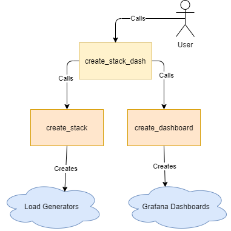

# Using create_stack_dash.py to Create Load Generators and Corresponding Dashboards


## Table of Contents
  * [Introduction](#introduction)
  * [Prerequisites](#prerequisites)
  * [Using config.env to pass parameters to create_stack_dash.py](#using-configenv-to-pass-parameters-to-create-stack-dashpy)
  * [Options available for the create_stack_dash.py script](#options-available-for-the-create-stack-dashpy-script)
  * [How create_stack_dash.py works](#how-create-stack-dashpy-works)
  * [Running the create_stack_dash.py script](#running-the-create-stack-dashpy-script)
  * [Troubleshooting](#troubleshooting)


## Introduction

This script launches a Cloudformation stack that spins up load generators. Then it creates Grafana Dashboards that display various metrics from the load generators.

## Prerequisites

1. Install [Python](https://www.python.org/downloads/).

2. Ensure boto3, requests and dotenv python packages are installed. This can be done using the following console commands:

```
pip install boto3
pip install requests
pip install python-dotenv
```

3. Set AWS authentication for the Cloudformation stack that will be created. This can be done by configuring AWS on the machine running the script using this script. Make sure AWS CLI is installed on the machine and that a user exists with an AWS access key (can be created under IAM, Security Credentials in the AWS console), then run the following commands:

```
aws configure
```

Prompts will appear asking for the following information:

```
AWS Access Key ID:
AWS Secret Access Key:
Default region name [eu-west-1]:
Default output format [None]:
```

Input the correct values; the last prompt can be left at default by pressing enter and skipping input.

Once configured, the AWS credentials and config files can be found in the AWS folder located in "~/.aws/" on linux systems or "%USERPROFILE%\\.aws" in Windows systems. At the top of the config folder a profile name in brackets should be present (ex: [default], here "default" will be the profile name to use in the config.env file discussed in the next step).

4. Update the config.env file with the AWS profile information.

Create config.env file by copying the existing config.env.sample file. Update the file with the following details:

- aws_profile_name - The AWS profile created in step 3.
- bucket - Bucket name where a file with number of instances will be created.

5. If using AWS Secrets Manager to store the Grafana API Key, a secret name would need to be provided either in the config.env file or via the command line:

```
GRAFANA_SECRET=MyGrafanaSecretName
```

or

```
python create_stack_dash.py -gs MyGrafanaSecretName
```

## Using config.env to pass parameters to create_stack_dash.py

The config.env file is the preferred way to pass parameters to this script, it should be located in the same folder as create_stack_dash. It contains many parameters that translate to options (listed in options section below) when running the script. For a more detailed description of each parameter, [refer to the table of parameters available below](#options-available-for-the-create-stack-dashpy-script). Below is a sample config.env file:

```
AWS_PROFILE_NAME=glasswall
REGION=eu-west-1
SCRIPT_BUCKET=aws-testengine-s3
SCRIPT_NAME=script/StartExecution.sh
TEST_DATA_BUCKET=icap-perf-test-data
TEST_DATA_FILE=files.csv
TEST_DATA_ACCESS_SECRET=GlasswallDataRepositoryTestUser
TOTAL_USERS=4000
USERS_PER_INSTANCE=4000
INSTANCES_REQUIRED=1
RAMP_UP_TIME=300
DURATION=900
ICAP_ENDPOINT_URL=icap-client.uksouth.cloudapp.azure.com
INFLUX_HOST=64.159.132.71
PREFIX=aj-test
INSTANCES_REQUIRED=1
JMX_SCRIPT_NAME=ICAP_Direct_FileProcessing_v1.jmx
GRAFANA_URL=64.159.132.71:3000
GRAFANA_KEY=
GRAFANA_FILE=LatestDashboard.json
EXCLUDE_DASHBOARD=0
PRESERVE_STACK=0
GRAFANA_SERVER_TAG=GrafanaServer
GRAFANA_SECRET=GrafanaSecret
```

These parameters have corresponding options that can be used during script execution, they do not have to be set in config.env. Many of the parameters above are also optional, they can be omitted. Any options input manually via the command line will override options within the config.env file. For example, if the config.env file is set to allow dashboard creation:

```
EXCLUDE_DASHBOARD=0
```

But the option to exclude dashboard creation is used:

```
python create_stack_dash.py -x
```
The Dashboard will still not be created (the option -x prevents dashboard creation) despite the content of the config.env file.

## Options/Parameters available for the create_stack_dash.py script

To see the available options for when running the script, use:
```
python create_stack_dash.py -h
```

Below is a table highlighting all the available options. These options correspond to parameters in the config.env file, they share the same names/descriptions and can be used as a reference when creating your own config.env file.

<table>
<tr>
<td width="200"> Option</td> <td> Config.env Parameter </td> <td> Description </td>
</tr>
<tr>
<td> --total_users, -t </td> <td> TOTAL_USERS </td>
<td>
Total number of users for the test, Default value is 4000.
</td>
</tr>
<tr>
<td> --ramp_up_time, -r </td> <td> RAMP_UP_TIME </td>
<td>
Ramp up time, default value: 300 seconds
</td>
</tr>
<tr>
<td> --duration, -d </td><td> DURATION </td>
<td>
Duration of the test, default value: 900 seconds
</td>
</tr>
<tr>
<td> --icap_endpoint_url, -e </td><td> ICAP_ENDPOINT_URL </td>
<td>
The ICAP server URL
</td>
</tr>
<tr>
<td> --influx_host, -i </td><td> INFLUX_HOST </td>
<td>
IP address or hostname of the Influx Database
</td>
</tr>
<tr>
<td> --grafana_url, -g </td><td> GRAFANA_URL </td>
<td>
The URL to the Grafana database's home page (typically this would be the "MachineIP:3000")
</td>
</tr>
<tr>
<td> --grafana_key, -k </td><td> GRAFANA_KEY </td>
<td>
Grafana API Key (<a href="https://github.com/k8-proxy/aws-jmeter-test-engine/blob/master/jmeter-icap-poc/instructions/how-to-use-createDashboards-script.md">see prerequisits in this article on how to generate this</a>).
</td>
</tr>
<tr>
<td> --grafana_file, -f </td><td> GRAFANA_FILE </td>
<td>
Name/path of JSON file that will be used as a template to create Grafana Dashboards.
</td>
</tr>
<tr>
<td>--prefix, -p </td><td> PREFIX </td>
<td>
The prefix used in both the Cloudformation stack name and the name of the Dashboard and measurements created.
</td>
</tr>
<tr>
<td> --test_data_file </td><td> TEST_DATA_FILE </td>
<td>
Test data file name/path
</td>
</tr>
<tr>
<td> --jmx_script_name </td><td> JMX_SCRIPT_NAME </td>
<td>
JMX script file name/path
</td>
</tr>
<tr>
<td> --region </td><td> REGION </td>
<td>
AWS Region to use
</td>
</tr>
<tr>
<td> --preserve_stack, -s </td><td> PRESERVE_STACK (=0 or 1) </td>
<td>
This takes no arguments. If set (ex: create_stack_dash -s), it will prevent the stack created from being automatically deleted after the duration period specified above is complete.
</td>
</tr>
<tr>
<td> --exclude_dashboard, -x </td><td> EXCLUDE_DASHBOARD (=0 or 1)</td>
<td>
This takes no arguments. If set (ex: create_stack_dash -x), a Grafana dashboard will not be created when the script is run.
</td>
</tr>
<tr>
<td> --grafana_server_tag, -tag </td><td> GRAFANA_SERVER_TAG </td>
<td>
This takes the tag of the server containing the Grafana database; this server will automatically be started if it is stopped. Tags in AWS have both a key and a value. The key field should contain "Name", only the value of the tag is what should be provided to this option. The tag must have a value field; it should not be empty. (Note: The --grafana_url option will prevent this option from taking effect, as the Grafana server IP would be obtained directly from that).
</td>
</tr>
<tr>
<td>--grafana_secret, -gs</td><td> GRAFANA_SECRET </td>
<td>
The secret name of the Grafana API Key inside AWS Secrets Manager. This will be used to retrieve the key for use when generating Grafana dashboards. (Note: The --grafana_key option will prevent this option from taking effect; a user directly providing a key would negate the need for a key lookup).
</td>
</tr>
</table>

## How create_stack_dash.py works



## Running the create_stack_dash.py script

To run the create_stack_dash.py script, use the following command:
```
python create_stack_dash.py
```

Followed by the options required. This can be done manually, as seen in this example:
```
python create_stack_dash.py -f "grafana_template.json" -k "grafana key" -g "link to grafana home page" -p "test-prefix"
```
Or the Config.env file would contain all the parameters required.

A successful run should output information on number of users, duration, and links to the end point and Grafana dashboard. See example below:
```
Creating Load Generators...
Deploying 1 instances in the ASG by creating test-prefix-aws-jmeter-test-engine-2020-11-03-01-39 cloudformation stack
Stack created with the following properties:
Total Users: 4000
Duration: 900
Endpoint URL: icap-client.uksouth.cloudapp.azure.com
Creating dashboard...
Dashboard created at:
http://64.159.132.71:3000//d/LVI8JIhMk/test-prefix-icap-live-performance-dashboard
Stack will be deleted after 45 minutes
10.0 minutes have elapsed, stack will be deleted in 35.0 minutes
20.0 minutes have elapsed, stack will be deleted in 25.0 minutes
30.0 minutes have elapsed, stack will be deleted in 15.0 minutes
40.0 minutes have elapsed, stack will be deleted in 5.0 minutes
deleting stack named: test-prefix-aws-jmeter-test-engine-2020-11-03-01-39
```

## Troubleshooting

Below is a list of potential issues end users might face along with some suggested solutions:

### Grafana Dashboard is not being created
- Check that the "exclude_dashboard" option is not enabled
- The grafana_key or grafana_secret_id options in config.env must be entered correctly (grafana_secret_id should refer to the name of the secret in AWS Secrets Manager)
- Grafana API Key must have correct permissions (must be Editor or Admin) and that it has not expired. [See this file](https://github.com/k8-proxy/aws-jmeter-test-engine/blob/master/jmeter-icap-poc/instructions/how-to-use-create_dashboards-script.md) for more information on how to create a Grafana API Key.
- If using a custom Grafana URL, make sure the correct port is being used (default port is 3000)
- The machine running this script must have access to the server holding the Grafana instance (i.e. the EC2 instance containing the Grafana installation has its security group set to allow the machine running this script to enter).
- The Grafana JSON template should be formatted correctly, for more information refer to the [Grafana Dashboard API](https://grafana.com/docs/grafana/latest/http_api/dashboard/).

### EC2 instance containing Grafana installation is not auto-starting
- The machine attempting to start the EC2 instance must have the correct permissions set in the EC2 instance's security group.
- The option grafana_server_tag must be used to start the EC2 instance. It should contain only the value of the tag with a key field containing "Name". See below:


### Stacks are not being automatically deleted
- Ensure the option "preserve_stack" is not enabled
- create_stack_dash.py deletes only the stack that was created in an individual run. If the script is stopped before the delete process takes place (i.e. before the duration period + 15 minutes) for any reason, the stack it created will not be deleted and must be deleted manually.
