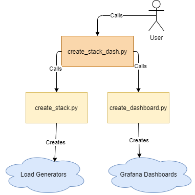

# Using create_stack_dash.py to Create Load Generators and Corresponding Dashboards

## Introduction

This script launches a Cloudformation stack that spins up load generators. Then it creates Grafana Dashboards that display various metrics from the load generators.

## Prerequisites

1. Install [Python](https://www.python.org/downloads/).

2. Ensure boto3 and requests python packages are installed. This can be done using the following console commands:

```
pip install boto3
pip install requests
```

3. Set AWS authentication for the Cloudformation stack that will be created. This can be done by configuring AWS on the machine running the script using this script. Make sure AWS CLI is installed on the machine and that a user exists with an AWS access key (can be created under IAM, Security Credentials in the AWS console), then run the following commands:

```
aws configure
```

Prompts will appear asking for the following information:

```
AWS Access Key ID:
AWS Secret Access Key:
Default region name [eu-west-1]:
Default output format [None]:
```

Input the correct values; the last prompt can be left at default by pressing enter and skipping input.

Once configured, the AWS credentials and config files can be found in the AWS folder located in "~/.aws/" on linux systems or "%USERPROFILE%\\.aws" in Windows systems. At the top of the config folder a profile name in brackets should be present (ex: [default], here "default" will be the profile name to use in the config.env file discussed in the next step).

4. Create config.env file.

Create config.env file by copying the existing config.env.sample file. Update the file with the following details:

- aws_profile_name - The AWS profile created in step 3.
- bucket=gov - Bucket name where a file with number of instances will be created.
- file_name -  File name with number of instances will be created in the s3 bucket.

## Options available for the create_stack_dash.py script

To see the available options for when running the script, use:
```
python create_stack_dash.py -h
```

Below is a table highlighting all the available options

<table>
<tr>
<td width="210"> Option </td> <td> Description </td>
</tr>
<tr>
<td> --total_users, -t </td>
<td>
Total number of users for the test, Default value is 4000.
</td>
</tr>
<tr>
<td> --users_per_instance, -u </td>
<td>
Number of users per ec2 instance, default value: 4000
</td>
</tr>
<tr>
<td> --ramp_up, -r </td>
<td>
Ramp up time, default value: 300 seconds
</td>
</tr>
<tr>
<td> --duration, -d </td>
<td>
Duration of the test, default value: 900 seconds
</td>
</tr>
<tr>
<td> --endpoint_url, -e </td>
<td>
The ICAP server URL
</td>
</tr>
<tr>
<td> --influx_host, -i </td>
<td>
IP address or hostname of the Influx Database
</td>
</tr>
<tr>
<td> --grafana_url, -g </td>
<td>
The URL to the Grafana database's home page (typically this would be the "<Machine Ip>:3000")
</td>
</tr>
<tr>
<td> --grafana_key, -k </td>
<td>
Grafana API Key ([see prerequisits in this article on how to generate this](https://github.com/k8-proxy/aws-jmeter-test-engine/blob/master/jmeter-icap-poc/instructions/how-to-use-createDashboards-script.md)).
</td>
</tr>
<tr>
<td> --grafana_file, -f </td>
<td>
Name/path of JSON file that will be used to create Grafana Dashboards.
</td>
</tr>
<tr>
<td> -p, --prefix </td>
<td>
The prefix used in both the Cloudformation stack name and the name of the Dashboard and measurements created.
</td>
</tr>
</table>

## How create_stack_dash.py works



## Running the create_stack_dash.py script

To run the create_stack_dash.py script, use the following command:
```
python create_stack_dash.py
```

Followed by the options required. This can be done manually, as seen in this example:
```
python create_stack_dash.py -f "grafana_template.json" -k "grafana key" -g "link to grafana home page" -p "test-prefix"
```
It can also be done using a file that contains all the arguments in separate lines (note, file name should be preceded by an '@' character):
```
python create_stack_dash.py @args.txt
```

Here is an example what arg.txt's contents may look like:
```
--total_users
400
--ramp_up
300
--duration
900
--endpoint_url
gw-link.dgp.usanorth.gdfghd.io
--influx_host
55.123.133.82
--grafana_url
http://55.123.133.82:3000/
--key
iR0cyOG9vUWhDUEMiLCJuIjoiZ2xsIiwjF9135kN$IPFJFlgkajtF
--grafana_file
ICAP-live-performance-dashboard.json
--prefix
test-run-1
```

A successful run should output information on number of users, duration, and links to the end point and Grafana dashboard. See example below:
```
Creating Load Generators...
Deploying 1 instances in the ASG by creating testprefixaws-jmeter-test-engine-2020-10-27-22-00 cloudformation stack
Stack created with the following properties:
Total Users: 400 users
Duration: 900 seconds
Endpoint URL: gw-link.dgp.usanorth.gdfghd.io
Creating dashboard...
Dashboard created at:
http://55.123.133.82:3000//d/4YK94UtGk/test-run-1-icap-live-performance-dashboard
```
