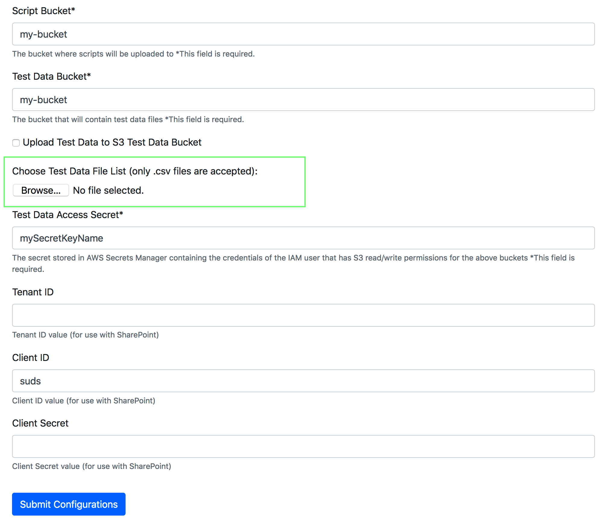

# How to prepare test data ?

This instruction assumes basic Load Test framework setup is done using the main instructions in https://github.com/k8-proxy/aws-jmeter-test-engine/blob/master/README.md

The framework comes to setup sample test data and the data should be uploaded to the s3 test data bucket as described in documentation in above link.

**Question comes how to prepare new data set?**

The framework is designed to work on CSV file that contains the following minimum file meta data:

- filename,path,type,original_hash,rebuild_hash

**filename** - name of file with extension: test.pdf

**path** - location of the file. Structure is fileType/fileHash, for example: pdf/e7969907ce62ff7b3962a51a0c2dc926480453b04813c7071f6417d0138ced8c. The path does not necessarily need to have fileHash as subfolder name.

**original_hash**: the file hash calculated before processing with SHA-256 algorithm

**rebuild_hash**: the out file hash calculated with SHA-256 algorithm

(https://github.com/k8-proxy/aws-jmeter-test-engine/blob/master/jmeter-icap/scripts/ICAP-Direct-File-Processing/gov_uk_files.csv is example comprehensive meta data CSV file, but minimum required fields are mentioned above)

The load test framework will send files for processing and compare rebuild hash with the one in the excel file. 

Once the CSV file containing above meta-data is ready, then actual test files should be uploaded to the test data bucket. It is better to prepare them locally and then upload to the s3 bucket. The structure of the test data folders should be:

bucket->fileType->subFolder->actualFile

Once test files are in s3 bucket then we have to set the load test framework to use new CSV file.

The framework UI interface allows to upload new CSV test data metada file. It is in UI -> Setup page. 

Select the new CSV and click on Submit Configurations button.

**Note**: Upload Test Data to S3 bucket feature uploads only the test data provided by the framework internally and not any new test data. 

