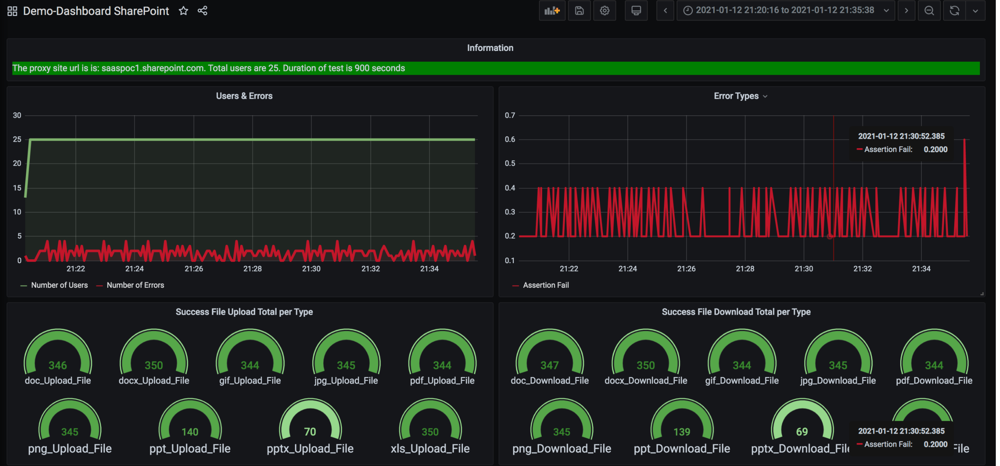

# How to generate Scaled Load Via UI ?

This instruction assumes basic Load Test framework setup is done using the main instructions in https://github.com/k8-proxy/aws-jmeter-test-engine/README.MD

The AWS Performance Test Execution Framework provided possibility to run scaled load via it's UI interface.

UI interface provided possibility to run 3 types of Load:

- Direct ICAP server: this load will generate load directly to ICAP end point.
- Proxy Offline: this load will generate traffic against proxied offline gov.uk site
- Proxy Sharepoint: this load will generate traffic against proxied sharepoint site.

Once EC2 instance created using provided AMI, there are certain configurations needed in that EC2 machine to be able to successfull run scaled load against target systems.

This document will explain those needed configuration details and UI interface features.

## What do I need to configire in EC2?

In EC2 virtual machine created via provided AMI, the following manual configurations needed to be done:

- Go to scripts folder and open config.env file for editing:

```bash
sudo nano /opt/git/aws-jmeter-test-engine/jmeter-icap/scripts/config.env
```
 Modify the following parameters:
 - SCRIPT_BUCKET - this is bucket name you created in initial setup
 - TEST_DATA_BUCKET - unless otherwise different bucket used for test data, this is usually exactly same as script_bucket. Provide the bucket name.
 - TEST_DATA_ACCESS_SECRET - this is AWS secret key name you created in inital setup
 - REGION - default region is eu-west-1. If you are working on other region, please, provide that region info here.
 
In case of Proxy Sharepoint load type, the following additional parameters needs to be modified :
- TENANT_ID : This is tenant id
- CLIENT_ID: this is client id
- CLIENT_SECRET: this is client secret. 

https://github.com/k8-proxy/aws-jmeter-test-engine/blob/master/jmeter-icap/instructions/How-to-Generate-Load-against-Proxied-SharePoint.md instructions has details about how to setup Proxied Sharepoint load.

save the file and restart the following service:

```bash
sudo systemctl stop flask_scaled 
sudo systemctl start flask_scaled
sudo systemctl status flask_scaled
```
Next go to 

```bash
/opt/git/aws-jmeter-test-engine/jmeter-icap/scripts
sudo sh changeIP.sh
```

## How to generate load?

Load generation can be triggered via provided UI interface.

UI interface looks like this and accessible via http://give-virtual-machine-ip


The Load Generator UI form has the following options:

- Total Users: 
    - How many total concurrent requests would you like to send? Default: 25
    - Maximum number of total users depends on the Virtual Machine resources:

| vCPU     | RAM | Total Users    | 
| :----:   | :----:   |    :----: |
| 2-4      | 2-4 GB     | 50-500   |
| 4-6  | 8-16  GB      | 500-1000| 
| 8+ | 32+  GB      | 4000| 

- Rampup time: How fast you would like to ramp up total users? Default is 300.
- Duration: How long would you like to generate load? Default is 900
- Load Type: Select desired load type. In case of Sharepoint.
    - Direct: this load type used to generate traffic against ICAP Server
        - ICAP Server Endpoint URL*: the ICAP server endpoint. The endpoint should be accessible from a network where load generator machines will be running
        - TLS and TLS Ignore Cert Errors: These settings will enable/disable TLS and ignoring of certification errors. Default is both values are on.
        - Port: ICAP Server port. For TLS default port is 443. For non-TLS default port is 1344
    - Proxy Offline: this type will generate traffic against provided offline gov uk site
        - Proxy IP Address*: this IP address will be added to /etc/hosts file of load generator machine.
    - Proxy Sharepoint: this load type will generate traffic against proxied sharepoint site.
        -  SharePoint Endpoint URL name: without http/https. Example: mysite.sharepoint.com
        -  SharePoint Proxy IP and Hostnames*: This is needed in order to modify hosts file in LoadGenerators so that traffic goes via proxy.
        -  see https://github.com/k8-proxy/aws-jmeter-test-engine/blob/master/jmeter-icap/instructions/How-to-Generate-Load-against-Proxied-SharePoint.md for more details

- Prefix: prefix is used to distinquish different dashboards and measurements. For different kind of load scenarios it is good to use their own prefix so that dashboard view would be unique for that specific scenario

**Load generation process is simple**:

- Ensure that target application under test is up and running
- Open browser and access Load Generation UI http://virtual-machine-ip
- Enter load scenarios based on above description
- Click on Generate Load
- Dashboard link will be shown in the page


if you would like to stop the test, just click on "Stop Load" button.

## How to use performance dashboard?

After you click Generate Load button, dashboard link for that specific prefix will be shown in the page.

Click that link and it will open dashboard login page:


Enter admin/glasswall and then dashboard ui will be visible with your own prefix:




