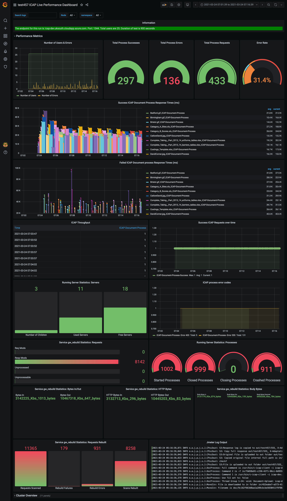
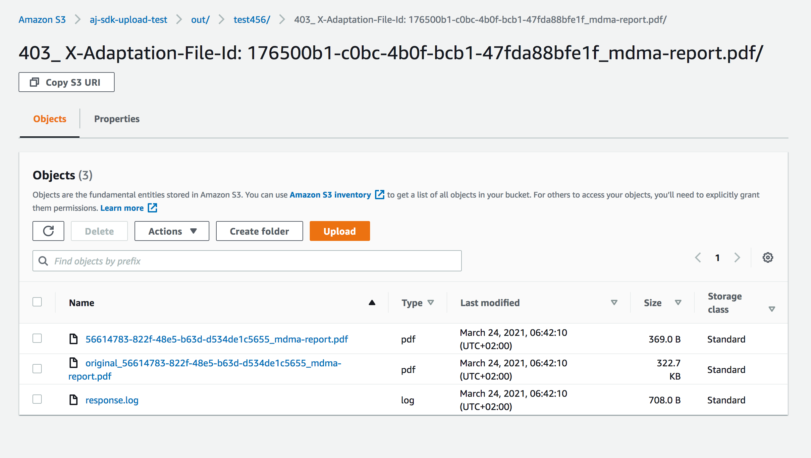

# What kind of metrics are available Performance Dashboard?

The ICAP AWS Performance Test Framework comes with performance dashboard in order to help in result analysis.

Here is sample dashboard:

Below is a table highlighting all the available metrics. 

<table>
<tr>
<td width="200"> Metric Name</td> <td> Measurement </td> <td> Description </td>
</tr>
<tr>
<td> Number of Users </td> <td> count </td>
<td>
Total number of users for the test
</td>
</tr>
<tr>
<td> Number of Errors -r </td> <td> count </td>
<td>
Total errors over time. 
</td>
</tr>
<tr>
<td> Total Process Successes </td><td> count </td>
<td>
Sum of all successful ICAP file process requests i.e how many files are processed successfully during the run?
</td>
</tr>
<tr>
<td> Total Process Errors </td><td> count </td>
<td>
How many files were not processed correctly during the run?
</td>
</tr>
<tr>
<td> Total Process Requests</td><td> count </td>
<td>
How many files were sent over to ICAP during the test run?
</td>
</tr>
<tr>
<td> Error Rate </td><td> percentage </td>
<td>
What is the error percentage during the test run? 
</td>
</tr>
<tr>
<td> Success ICAP Document Process Response Times </td><td> milliseconds </td>
<td>
Processing response time (ms) for each file. Response times is displayed for each file by it's name. What is the ICAP succesful processing time for each file?
</td>
</tr>
<tr>
<td> Failed ICAP Document Process Response Times </td><td> milliseconds </td>
<td>
Processing response time (ms) for each file. Response times is displayed for each file by it's name. What is the ICAP processing time for each file when processing had an error?
</td>
</tr>
<tr>
<td>Success ICAP requests over time</td><td> count</td>
<td>
Succesful processing throughput per second.
</td>
</tr>
<tr>
<td> ICAP Process Error Codes </td><td> count </td>
<td>
Error response codes over time. Details of the error codes is provided below.
</td>
</tr>
<tr>
<td> ICAP/1.0 500 </td><td> count </td>
<td>
500 Internal server error
</td>
</tr>
<tr>
<td> ICAP/1.0 503 </td><td> count </td>
<td>
Service overloaded
</td>
</tr>
<tr>
<td> ICAP/1.0 400 </td><td> count </td>
<td>
400 Bad request
</td>
</tr>
<tr>
<td> ICAP/1.0 502 </td><td> count </td>
<td>
502 Bad Gateway
</td>
</tr>
<tr>
<td> ICAP/1.0 506 </td><td> count</td>
<td>
506 Server too busy
</td>
</tr>
<tr>
<td> ICAP/1.0 551 </td><td> count </td>
<td>
551 Resource unavailable.
</td>
</tr>
<tr>
<td>-ICAP/1.0 403</td><td> count</td>
<td>
403 Forbidden
</td>
</tr>
<tr>
<td>ICAP/1.0 404</td><td> count </td>
<td>
404 Service Not Found
</td>
</tr>
<tr>
<td>ICAP/1.0 405</td><td> count </td>
<td>
405 Method Not Allowed
</td>
</tr>
<tr>
<td>ICAP/1.0 408</td><td>count</td>
<td>
408 Request Timeout
</td>
</tr>
<tr>
<td> 522 </td> <td>count</td>
<td>
Failed to connect to icap server,failed/timedout.
</td>
</tr>
<tr>
<td> HTTP/1.0 403 Forbidden </td> <td>count</td>
<td>
403 Fordbidden
</td>
</tr>
<tr>
<td>555</td><td>count</td>
<td>
Hash is mismatching
</td>
</tr>

</table>

In error cases the framework will automatically output original and rebuild files together with full response code to the test data s3 bucket: out folder->prefix folder->responseCode_adaptationFileId_fileName folder-> files+ response.log

Here is example of such output:

Additionally jmeter log file can be found under that prefix subfolder in out folder in the test data s3 bucket.